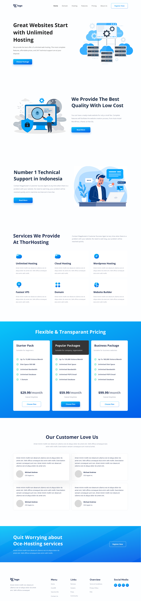
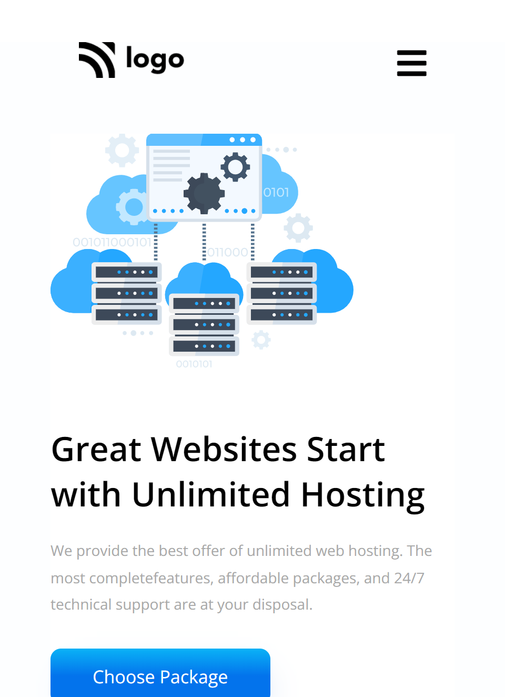

# Portfolio Project [](http://www.gnu.org/licenses/agpl-3.0)

My name is Rakshit koyani.
This is full fronted part of one page website which provides hosting service. It contains 5 pages domain, hosting, pricing, features, and contact.

## 🛠 Technologies Used

- HTML5 - Hyper Text Markup Language
- CSS3 - Cascading Spread Sheet

## Demo

1. desktop
   
1. Mobile
   

## Run Locally

Clone the project

```bash
  git clone https://github.com/rakshitkoyani/hosting-landing-page.git
```

Go to the project directory

```bash
  cd hosting-landing-page
```

## Author

- [Rakshit Koyani](https://www.github.com/rakshitkoyani)
  - [](https://www.linkedin.com/in/rakshit-koyani-507040132/)
  - [](https://www.instagram.com/rakshitkoyani/)
  - [](https://www.twitter.com/rakshit_koyani)

## What I have learnt By working on this project

1. I research about linear gradient to give a better look to the buttons and backgrounds.
2. I learn to use absolute position to add more realistic look in package section of the website.
3. code reusability by making the button class and use it multiple times.

## Honest Time to finish the project

It takes about 6 hours approximately to fully complete this project as i was new to HTML and CSS and I had to learn some new things like sibling selectors without class and different positioning.

## Live link of the project

https://rakshitkoyani.github.io/hosting-landing-page/
